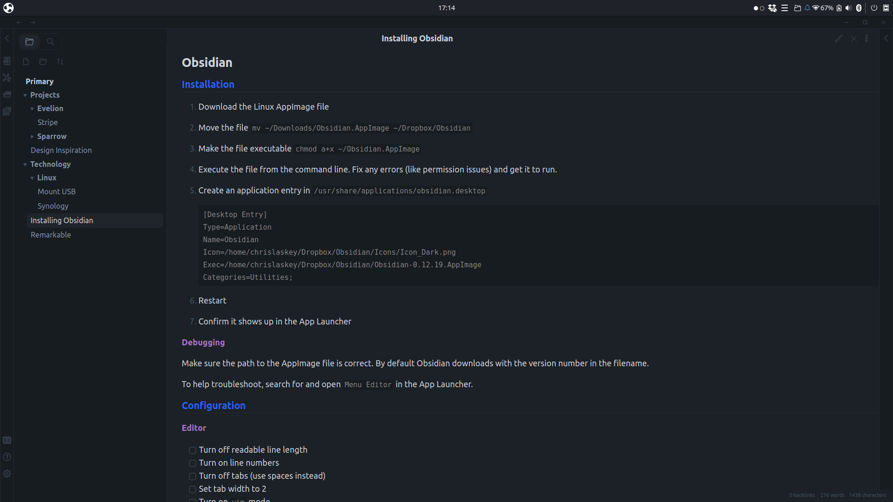

# Buzz

> ### A custom theme for [Obsidian](https://obsidian.md/)

## Manual Installation

1. Download this repo
1. Copy the `obsidian.css` file into your vault's `/.obsidian/themes` directory
1. Rename the file to `Buzz.css` so it will have a unique name in the theme selection dropdown
1. Open the **Settings** in Obsidian
1. Navigate to **Appearances** tab under **Options**
1. Under the **Themes** section, click on the dropdown menu next to **Theme** heading
1. Select `Buzz` and then you're done! 🎉

## Acknowledgements

This theme is a fork of
[**`colineckert/obsidian-things`**](https://github.com/colineckert/obsidian-things).
A big thank you to Colin for the great work!

If you enjoy the theme, please consider [buying @colineckert
a coffee](https://github.com/colineckert/obsidian-things#support).
